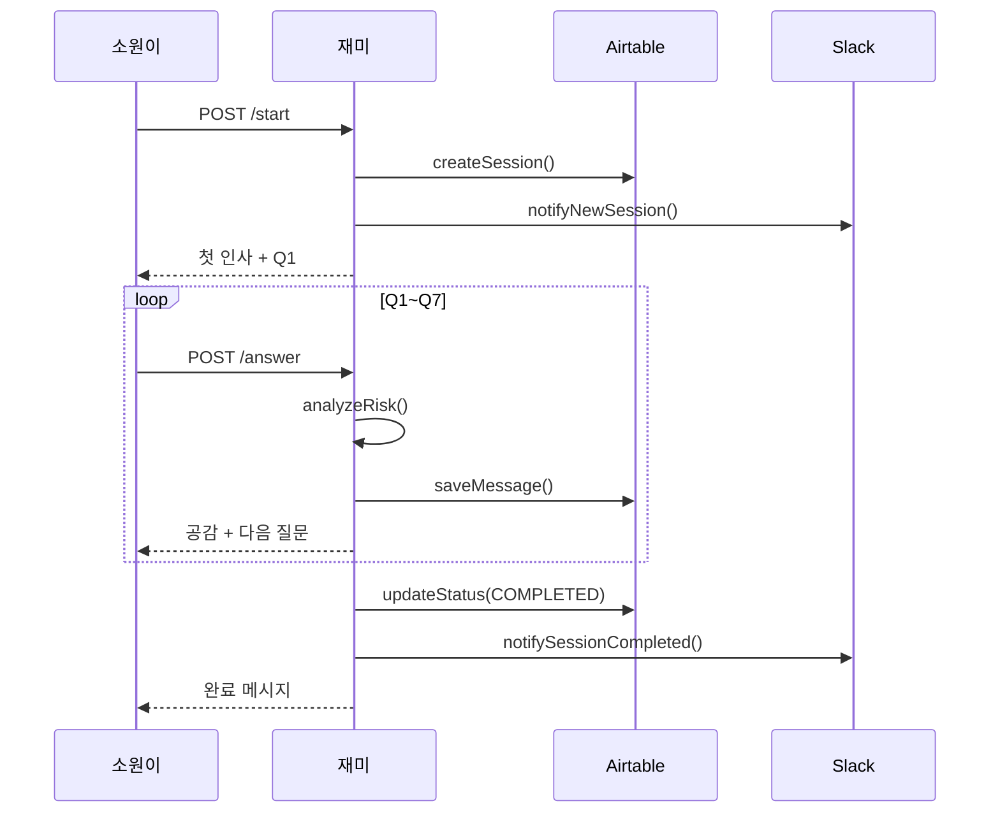
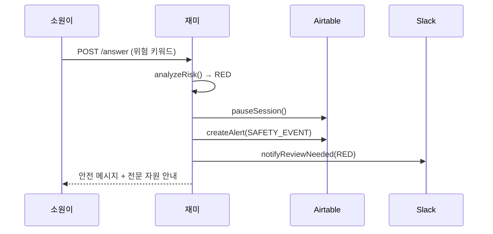

# 재미 (Jaemi) - System Bridge SSOT

> **Version**: 1.0.0 | **Updated**: 2026-01-17
> **Purpose**: 재미 페르소나와 시스템 컴포넌트 연결 매핑

---

## 1. 시스템 연결 맵 (Integration Map)

```
┌─────────────────────────────────────────────────────────────┐
│                    재미 (CRO) 연결 범위                       │
├─────────────────────────────────────────────────────────────┤
│                                                             │
│  [인입]         [처리]           [출력]          [알림]      │
│                                                             │
│  ┌─────┐      ┌──────────┐     ┌─────────┐    ┌─────────┐  │
│  │ Web │─────▶│ Wish     │────▶│ Session │───▶│ Slack   │  │
│  │ API │      │ Intake   │     │ Summary │    │ Alerts  │  │
│  └─────┘      │ Service  │     └─────────┘    └─────────┘  │
│               └──────────┘                                  │
│  ┌─────┐           │                                       │
│  │Kakao│───────────┤         ┌─────────┐    ┌─────────┐   │
│  │ Bot │           │         │ Risk    │───▶│Airtable │   │
│  └─────┘           └────────▶│ Gate    │    │ SSOT    │   │
│                              └─────────┘    └─────────┘   │
│                                                             │
└─────────────────────────────────────────────────────────────┘
```

---

## 2. 주요 서비스 연결

### 2.1 wishIntakeService.js
**역할**: WISH 7문항 대화 플로우 핵심 엔진

| 함수 | 재미 역할 | 호출 시점 |
|------|----------|----------|
| `createSession()` | 세션 시작 인사 | 첫 접촉 |
| `submitAnswer()` | 답변 수신 + 공감 응답 | 매 답변 |
| `analyzeRisk()` | 리스크 감지 → 톤 조절 | 답변 처리 중 |
| `processSessionSummary()` | 완료 메시지 + 요약 안내 | 7문항 완료 후 |

### 2.2 wishIntakeSlackService.js
**역할**: 운영진 알림 (재미 → 코미/푸르미르)

| 알림 타입 | 재미 관련 내용 |
|----------|--------------|
| `NEW_SESSION` | 새 소원이 인입 알림 |
| `REVIEW_NEEDED` | RED/YELLOW 감지 시 검수 요청 |
| `SESSION_COMPLETED` | 세션 완료 + 요약 알림 |

### 2.3 Airtable 테이블 연결

```
┌────────────────────────┐     ┌────────────────────────┐
│ Wish Intake Sessions   │     │ Wish Intake Messages   │
├────────────────────────┤     ├────────────────────────┤
│ session_id (PK)        │◀───▶│ session_id (FK)        │
│ correlation_id         │     │ message_id (PK)        │
│ run_status             │     │ question_key           │
│ risk_level             │     │ answer_final_text      │
│ pause_flow             │     │ risk_level             │
│ summary_short          │     │ risk_flags             │
│ summary_structured     │     └────────────────────────┘
└────────────────────────┘
```

---

## 3. 메시지 템플릿 연결

### 3.1 재미 응답 템플릿 위치
```
config/
├── messageTemplates.js    ← 기존 SMS/알림톡 템플릿
└── jaemiResponses.js      ← 재미 대화 응답 (TODO: 분리 예정)
```

### 3.2 WISH 7문항 (DEC-002)
```javascript
// services/wishIntakeService.js
const WISH_QUESTIONS = [
  { id: 'Q1', key: 'WISH_1L', display: '...' },
  { id: 'Q2', key: 'WHY_NOW', display: '...' },
  // ... Q3-Q7
];
```

### 3.3 리스크 게이트 (DEC-003)
```javascript
// services/wishIntakeService.js
const RISK_PATTERNS = {
  RED: { selfHarm: [...], violence: [...], ... },
  YELLOW: { medical: [...], manipulation: [...], ... }
};
```

---

## 4. API 엔드포인트 매핑

### 재미가 담당하는 API
| Method | Endpoint | 재미 역할 |
|--------|----------|----------|
| POST | `/api/wish-intake/start` | 세션 시작 + 첫 인사 |
| GET | `/api/wish-intake/:sessionId` | 현재 상태 확인 |
| POST | `/api/wish-intake/:sessionId/answer` | 답변 처리 + 다음 질문 |
| GET | `/api/wish-intake/:sessionId/messages` | 대화 기록 조회 |
| POST | `/api/wish-intake/:sessionId/summary` | 요약 생성 |
| GET | `/api/wish-intake/:sessionId/summary` | 요약 조회 |

### 재미 연계 비활성 API (다른 담당)
| Method | Endpoint | 담당 |
|--------|----------|------|
| POST | `/api/wish` | 기존 소원 접수 (코미) |
| POST | `/api/message/send` | 메시지 발송 (루미/코미) |

---

## 5. 이벤트 흐름 (Event Flow)

### 5.1 정상 플로우


### 5.2 RED 감지 플로우


---

## 6. 환경변수 의존성

### 재미 관련 필수 환경변수
```env
# Airtable (세션/메시지 저장)
AIRTABLE_API_KEY=pat.xxx
AIRTABLE_BASE_ID=appXXX
AIRTABLE_TABLE_SESSIONS=Wish Intake Sessions
AIRTABLE_TABLE_MESSAGES=Wish Intake Messages

# Slack (운영 알림)
SLACK_BOT_TOKEN=xoxb-xxx
SLACK_CHANNEL_INTAKE=C0A8CRLJW6B
SLACK_CHANNEL_REVIEW=C0A8CRP3K5M

# OpenAI (요약 생성)
OPENAI_API_KEY=sk-xxx
```

---

## 7. 확장 포인트 (Extension Points)

### 향후 연결 예정
| 기능 | 연결 대상 | 우선순위 |
|------|----------|---------|
| 카카오톡 봇 연동 | kakaoService.js | P1 |
| 음성 인터페이스 | STT/TTS 서비스 | P2 (금지됨) |
| 로드맵 자동 생성 | roadmapService.js | P1 |
| 응원 메시지 발송 | solapiService.js | P0 (완료) |

### 코드 확장 시 주의
```
⚠️ 재미 응답 수정 시: jaemi_core.md 톤 체크 필수
⚠️ 리스크 패턴 추가 시: DEC-003 문서 업데이트 필수
⚠️ 새 질문 추가 시: DEC-002 승인 필요 (푸르미르)
```

---

*Last Updated: 2026-01-17 | Author: Claude Code*
